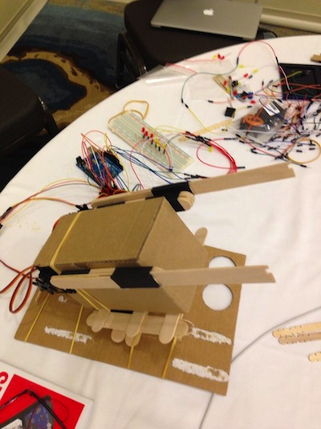

  
NodeBots Missile Command
===============

Our mission is simple. Let no nodecopter survive.

Built during JSConf 2013 for the [@nodebots](https://twitter.com/nodebots) hackathon.

            ---------------+---------------
                      ___ /^^[___              _
                     /|^+----+   |#___________//
                   ( -+ |____|   _______-----+/
                    ==_________--'            \
                      ~_|___|__

                     ,:
                   ,' |
                  /   :
               --'   /
               \/ />/
               / <//_\
            __/   /
            )'-. /
            ./  :\

## The finished product

Firing in action: [http://youtu.be/0FAfu-Zowuo](http://youtu.be/0FAfu-Zowuo)

And the nodecopter we shot down: [https://t.co/93hdVbPaMR](https://t.co/93hdVbPaMR)

## The core foundation

The code is rather specific to the arduino board setup.

Start with an [Arduino Uno](https://www.sparkfun.com/products/11021).

Follow the steps [here](https://github.com/rwldrn/johnny-five) to prepare the arduino for Johnny Five.

## The board setup

We played around with six led lights, as a starting place to learn Johnny Five. I'm not going to describe that setup, except to say they were wired to ports 12, 11, 9, 8, 7, and 6. If I were recreating this I would just remove the code dealing with them.

The launcher was built using 3 [TowerPro SG5010 servos](http://www.seeedstudio.com/depot/towerpro-sg5010-servo-p-655.html). We used the 6 pronged attachment for the two servos handling the rubber bands, so a rubber band could be loaded, the servo moved 60 degrees, another loaded and so on. These particular servos only support 180 degrees rotation, so limited us to 3 bands per side. A continuous servo could handle the full six, you'd have to modify the code to support that.

The third servo was mounted to the bottom of the launcher, using a custom built stand out of popcicle sticks to support angling it from 0 to 50 degrees or so. Any further and it tipped over :).

The left servo was mounted to pin 5 and configured to be reversed, since it was mounted to the cardboard backwards.
The right servo was on pin 3.
The tilt servo was on pin 10.

The launcher was controlled via urls. We didn't build a UI on top of it given time constraints.
To load the left missile, call localhost:3000/load/0. For the right, localhost:3000/load/1.
Similarly to fire you can do /fire/0 and /fire/1, and to reset to 0 /clear/0 and /clear/1.
The tilt was controlled with /tilt/{degrees}, so /title/25 would angle it up 25 degrees.

